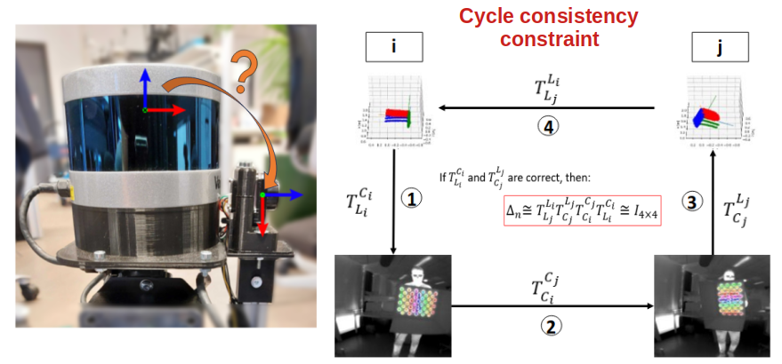

# Low-cost Extrinsic Calibration Between LIDAR and Thermal Camera for Indoor Mapping
## Introduction
[[Paper](https://isprs-annals.copernicus.org/articles/X-2-W2-2025/181/2025/)] [[Video](https://www.youtube.com/watch?v=0ODHZe4rVec)]

This is the code repository for the paper titled "Low-cost Extrinsic Calibration Between LIDAR and Thermal Camera for Indoor Mapping" presented at UAV-g 2025 in Espoo, Finland, September 10th-12th 2025. The paper is now available in the ISPRS Annals via the link above.

**Authors:** Benjamin R. van Manen, Ville Lehtola, Abeje Y. Mersha, Francesco Nex.

Corresponding author's email: b.r.vanmanen@saxion.nl

In this paper, we present an accurate and low-cost calibration method to estimate the extrinsic transformation between a thermal camera and a LIDAR. This method uses a half-box target with a heated asymmetric circles grid on one side to estimate each sensor’s pose from thermal and geometric features, then determines their transformation through a cycle consistency constraint.

## How to run

1. Clone this repo.
2. Create a conda environment, or a development container, using the dependencies in `environment.yaml`.
3. Read the introduction at the top of `main.ipynb` about the input dataset requirements.
4. In the first cell of `main.ipynb`, provide the location to the input dataset's root folder.
5. Run each subsequent cell 1 by 1. Intermediate and debugging results will be saved in the dataset's root folder.
6. Done!

A dataset can be requested by sending an email to the corresponding author.

## How to cite
van Manen, B. R., Lehtola, V., Mersha, A. Y., and Nex, F.: Low-cost Extrinsic Calibration Between LIDAR and Thermal Camera for Indoor Mapping, ISPRS Ann. Photogramm. Remote Sens. Spatial Inf. Sci., X-2/W2-2025, 181–188, https://doi.org/10.5194/isprs-annals-X-2-W2-2025-181-2025, 2025.

